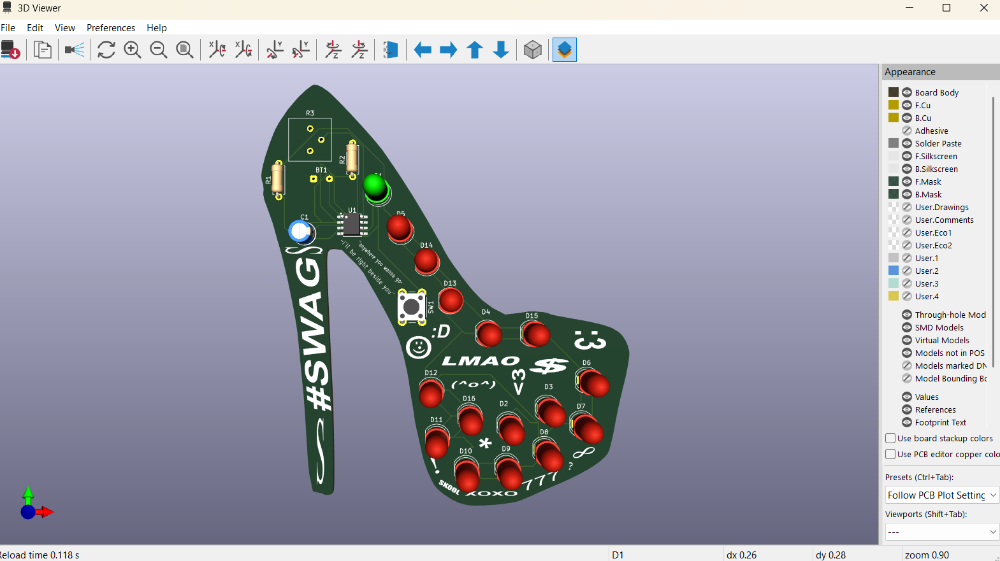

# blinky-pcb

## Components

- x16+ Red LEDs
- x1 555 Timer IC
- x1 10 μF Capacitor
- x1 100k Variable Resistor
- x1 10k Resistor
- x1 330 ohm resistor
- x1 1 Push Button
- x1 9V Battery Holder Clip

##

